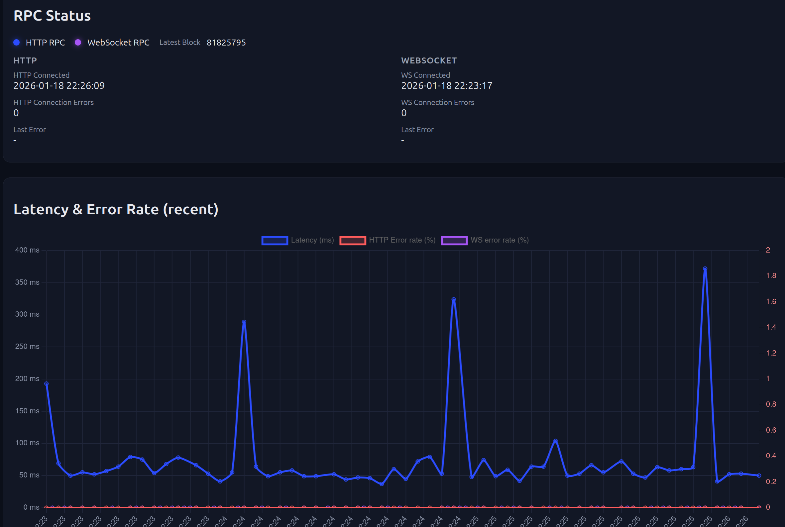

# ChainCheck

**ChainCheck** is a comprehensive Ethereum (and EVM-compatible) blockchain node monitoring solution that provides real-time insights into the performance, stability, and finality status of multiple RPC nodes simultaneously.



## Features

- **Fleet Overview**: Default start page shows all configured nodes at a glance with health scores, latency, block lag, and connection status — no more guessing which node is healthy
- **Per-Node Details**: Drill into any node for a full latency chart, block-finality timeline, anomaly log, and sample-by-sample breakdown
- **Dual-Mode Architecture**: Dedicated Ethereum mode (beacon chain consensus, attestations) and Cosmos mode (Polygon-style, majority-voting finality) — each tuned to the chain's finality model
- **Real-Time Monitoring**: Tracks latency and error rates for both HTTP polling and WebSocket `newHeads` subscriptions
- **Checkpoint Propagation Delays**: Measures head, safe, and finalized block delays to track how fast a node follows the canonical chain
- **Anomaly Detection**: Automatically flags block skips, reorgs (with depth), rate limits, timeouts, wrong heads, and connection drops
- **Block Finality Tracking**: Tags blocks as safe or finalized, propagating status backward through the parent-hash chain
- **Unified Block View**: Merges WebSocket and HTTP samples by block hash for complete block lifecycle tracking
- **First-Seen Delta**: In multi-node setups, shows which node saw each block first and how many milliseconds behind each node was
- **Canonical Rate & Block Quality**: Tracks what fraction of observed blocks ended up in the canonical chain (orphan detection via parent-hash linkage)
- **Health Score**: Composite 0–100 score per node, combining uptime, latency, head delay, and error rate
- **Attestation Tracking** (Ethereum only): Beacon committee attestation rounds per block (1–3 rounds = ~33%/67%/90% canonical confidence)
- **Metric Aggregation**: Raw samples (2 hours) roll up into minutely aggregates (3 days) and hourly aggregates (30 days)
- **Persistent Snapshots**: Optional on-disk JSON snapshots survive restarts
- **Configurable Gradient Charts**: The chart line and fleet sparklines use a configurable gradient — latency mode (blue → purple → red at 200 ms/500 ms) or head-delay mode (green → orange → red at 3 s/10 s), or solid color (`NONE`)

---

## Getting Started

### Prerequisites

- Java 21 or higher
- Maven 3.8+

### Build

```bash
mvn clean install
```

### Run (pick one)

```bash
# Default (no RPC nodes preconfigured — add your own in application.yml)
mvn spring-boot:run

# Ethereum mainnet — uses application-ethereum.yml
mvn spring-boot:run -Dspring-boot.run.profiles=ethereum

# Polygon mainnet — uses application-polygon.yml
mvn spring-boot:run -Dspring-boot.run.profiles=polygon

# Mock mode (fake RPC data — useful for UI development)
mvn spring-boot:run -Dspring-boot.run.profiles=mock
```

Open `http://localhost:8080` to see the Fleet Overview.

---

## Dashboard

### Fleet Overview (default page — `/`)

The Fleet Overview is the entry point. It presents every configured RPC node as a row in a comparison table:

| Column | Description |
|--------|-------------|
| **Health** | Composite score (0–100) with a color-coded badge (green ≥ 80, amber ≥ 50, red < 50) |
| **Node** | Name; reference node is marked |
| **Trend** | 1-hour sparkline of the configured metric (latency or head delay) with gradient coloring |
| **Latest Block** | Most recently observed block number; color indicates lead/lag vs fastest node |
| **Age** | Time since the node last saw a new block (green < 15 s, amber < 60 s, red otherwise) |
| **Uptime** | Success rate across the selected time range |
| **Latency P95** | 95th-percentile HTTP round-trip time |
| **Head Delay P95** | 95th-percentile time between block production and when the node first reported it |
| **Anomalies** | Count of anomalies in the selected time range |
| **WS** | WebSocket status; reconnection count in last 24 h |

Click **Details →** on any row to drill into the per-node view.

### Per-Node Details (`/node?node=KEY`)

The Details page shows the full picture for a single node:

- **Latency chart** with gradient coloring, P5–P99 bounds band, error-rate overlay, reorg/error bar overlays, and reference-node overlay
- **Head / Safe / Finalized delay charts** with configurable bounds
- **Network summary cards**: latency percentiles, IQR jitter, uptime, error rate, block quality (canonical rate, orphaned blocks, first-seen delta)
- **Anomaly log**: grouped consecutive anomalies with timestamps, type, and depth
- **Sample table**: every observed block hash with finality badge, latency, first-seen delta, and attestation round

A **← Fleet** back-link in the header returns you to the overview.

---

## Modes

ChainCheck has two operating modes set by `rpc.mode`. Choose the right one for your chain.

### Ethereum Mode (`rpc.mode: ethereum`)

Designed for Ethereum mainnet and testnets. A separate consensus (beacon) node is **required** for full finality tracking.

**How it works:**
- HTTP nodes poll `eth_blockNumber` (and optionally `safe`/`finalized` tags)
- WebSocket nodes subscribe to `eth_subscribe("newHeads")`
- On each `newHeads` event, ChainCheck immediately calls `eth_getBlockByHash` on the same node — because the block number in newHead payloads is **not reliable**. The hash is the only trusted block identity.
- 5 seconds later, a second HTTP call fetches transaction count, gas price, and a reliable latency measurement
- The consensus (beacon) node is the single source of truth for safe and finalized block hashes. Its knowledge is applied globally to **all** execution nodes by block hash — not per node
- Optional **attestation tracking** queries beacon committee data every few seconds and computes per-block canonical confidence (1–3 attestation rounds)

**The Golden Rule of newHeads processing:**

> Never derive chain state from WebSocket event order. Always derive chain state from block hashes and parent links.

The `newHeads` stream is a *best-effort* notification, not a canonical append-only log. Events may arrive out of order, be duplicated, or be dropped entirely. Two events may carry the same block number during a reorg. ChainCheck treats each event as a wake-up signal, then verifies the chain state via `eth_getBlockByHash`. Block identity is always the **hash**, never the number.

### Cosmos Mode (`rpc.mode: cosmos`)

Designed for EVM chains without a beacon chain (e.g., Polygon, BNB Chain, Avalanche C-Chain).

**How it works:**
- No consensus node — the reference head is determined by **majority voting** across all execution nodes
- WebSocket `newHeads` payloads are trusted directly (block number, hash, parentHash, timestamp come from the event)
- No delayed HTTP block verification
- Safe and finalized blocks are tracked **per execution node** from its own HTTP polling (`safe`/`finalized` tags). Status is not shared across nodes
- `safeDelayMs` and `finalizedDelayMs` are computed relative to block timestamp (not a consensus node observation time)

---

## Configuration

Configuration lives in `src/main/resources/application.yml`. The built-in Spring profiles `ethereum` and `polygon` provide ready-to-use templates.

### Ethereum Mode Example

```yaml
# application.yml (or add spring.profiles.active=ethereum to load application-ethereum.yml)
rpc:
  mode: ethereum               # Activates Ethereum-specific processing
  title: "Ethereum Mainnet"
  title-color: "#627eea"

  # HTTP polling — safe/finalized alternate when WS is active
  get-safe-blocks: false       # Set true to poll eth_getBlockByNumber("safe")
  get-finalized-blocks: false  # Set true to poll eth_getBlockByNumber("finalized")
  scale-change-ms: 500         # Chart scale boundary (ms): below this = "low" band
  scale-max-ms: 60000          # Chart Y-axis cap (ms)

  defaults:
    connect-timeout-ms: 2000
    read-timeout-ms: 5000
    max-retries: 1
    retry-backoff-ms: 200

  persistence:
    enabled: false
    file: ./chaincheck-snapshot.json
    flush-interval-seconds: 30

  anomaly-detection:
    high-latency-ms: 2000          # Flag HTTP responses above this threshold
    long-delay-block-count: 15     # Flag head delay above N blocks
    stale-block-threshold-ms: 30000  # Flag latest blocks older than this

  # Beacon / consensus node (required for full Ethereum finality tracking)
  consensus:
    display-name: my-beacon-node
    http: http://beacon-node:5052
    safe-poll-interval-ms: 30000       # Poll finality_checkpoints every 30 s
    finalized-poll-interval-ms: 30000
    timeout-ms: 2000

    # Attestation tracking (optional — queries beacon committee data per slot)
    attestations-enabled: true
    committees-path: /eth/v1/beacon/states/head/committees
    attestation-tracking-interval-ms: 3000
    attestation-tracking-max-attempts: 100

  nodes:
    - name: My Local Node
      http: http://geth-node:8545
      ws: ws://geth-node:8545
      poll-interval-ms: 10000          # Poll every 10 s when WS is active

    - name: PublicNode
      http: https://ethereum-rpc.publicnode.com
      ws: wss://ethereum-rpc.publicnode.com
      poll-interval-ms: 10000

    - name: Ankr (with API key)
      http: https://rpc.ankr.com/eth
      ws: wss://rpc.ankr.com/eth
      poll-interval-ms: 10000
      headers:
        Authorization: "Bearer <your-api-key>"

    - name: DRPC
      http: https://eth.drpc.org
      ws: wss://eth.drpc.org
      poll-interval-ms: 10000
```

### Cosmos Mode Example (Polygon)

```yaml
# application.yml (or add spring.profiles.active=polygon to load application-polygon.yml)
rpc:
  mode: cosmos                 # Activates Cosmos/majority-voting processing
  title: "Polygon Mainnet"
  title-color: "#8247e5"

  # No consensus node — finality comes from each node's own eth_getBlockByNumber("finalized")
  get-safe-blocks: false
  get-finalized-blocks: true   # Poll finalized tag per execution node

  scale-change-ms: 500
  scale-max-ms: 30000

  defaults:
    connect-timeout-ms: 2000
    read-timeout-ms: 4000
    max-retries: 1
    retry-backoff-ms: 200

  anomaly-detection:
    high-latency-ms: 2000
    long-delay-block-count: 15

  nodes:
    - name: polygon-rpc.com
      http: https://polygon-rpc.com
      # ws: wss://polygon-rpc.com     # Uncomment to enable WebSocket tracking
      poll-interval-ms: 2000

    - name: PublicNode
      http: https://polygon-bor-rpc.publicnode.com
      ws: wss://polygon-bor-rpc.publicnode.com
      poll-interval-ms: 5000

    - name: DRPC
      http: https://polygon.drpc.org
      ws: wss://polygon.drpc.org
      poll-interval-ms: 5000

    - name: QuikNode
      http: https://rpc-mainnet.matic.quiknode.pro
      ws: wss://rpc-mainnet.matic.quiknode.pro/ws
      poll-interval-ms: 5000
      headers:
        Authorization: "Bearer <your-api-key>"
```

### Using Spring Boot Profiles

ChainCheck ships with two pre-built profiles. Activate one instead of editing `application.yml` directly:

```bash
# Via Maven
mvn spring-boot:run -Dspring-boot.run.profiles=ethereum
mvn spring-boot:run -Dspring-boot.run.profiles=polygon

# Via environment variable
SPRING_PROFILES_ACTIVE=ethereum java -jar chaincheck.jar

# Via JVM flag
java -Dspring.profiles.active=polygon -jar chaincheck.jar
```

The profile YAML files (`application-ethereum.yml`, `application-polygon.yml`) are starting points — copy and edit them to match your actual node endpoints and API keys before running in production.

### Configuration Reference

#### Global settings (`rpc.*`)

| Key | Default | Description |
|-----|---------|-------------|
| `mode` | `cosmos` | Operating mode: `ethereum` or `cosmos` |
| `title` | `ChainCheck` | Dashboard title shown in the header |
| `title-color` | — | CSS color for the title text |
| `get-safe-blocks` | `false` | Poll `eth_getBlockByNumber("safe")` on execution nodes |
| `get-finalized-blocks` | `false` | Poll `eth_getBlockByNumber("finalized")` on execution nodes |
| `scale-change-ms` | `500` | Low-band boundary on the chart Y-axis (ms) |
| `scale-max-ms` | `30000` | Maximum chart Y-axis cap (ms) |
| `block-verification-delay-ms` | `5000` | Ethereum mode: delay before post-newHead HTTP verification call |
| `chart-gradient-mode` | `NONE` | Gradient coloring on the node-detail chart line: `LATENCY`, `NEWHEAD`, or `NONE` |
| `sparkline-data-source` | `LATENCY` | Metric used for fleet sparklines: `LATENCY` or `NEWHEAD` |

#### Default node settings (`rpc.defaults.*`)

| Key | Default | Description |
|-----|---------|-------------|
| `connect-timeout-ms` | `2000` | HTTP connect timeout |
| `read-timeout-ms` | `4000` | HTTP read timeout |
| `max-retries` | `1` | Retry attempts on transient failures |
| `retry-backoff-ms` | `200` | Base backoff between retries |

#### Anomaly detection (`rpc.anomaly-detection.*`)

| Key | Default | Description |
|-----|---------|-------------|
| `high-latency-ms` | `2000` | HTTP latency above this triggers a `DELAY` anomaly |
| `long-delay-block-count` | `15` | Head delay above N blocks triggers a `DELAY` anomaly |
| `stale-block-threshold-ms` | `30000` | HTTP latest block older than this triggers a `DELAY` anomaly |

#### Consensus node (`rpc.consensus.*` — Ethereum mode only)

| Key | Default | Description |
|-----|---------|-------------|
| `http` | — | Beacon node base URL |
| `safe-poll-interval-ms` | — | Poll interval for safe checkpoints (omit to disable) |
| `finalized-poll-interval-ms` | — | Poll interval for finalized checkpoints (omit to disable) |
| `timeout-ms` | `2000` | Request timeout for consensus node |
| `attestations-enabled` | `false` | Enable per-block attestation confidence tracking |
| `attestation-tracking-interval-ms` | `3000` | How often to poll committee data per slot |
| `attestation-tracking-max-attempts` | `100` | Maximum polling attempts per slot |

#### Per-node settings (`rpc.nodes[].*`)

| Key | Description |
|-----|-------------|
| `name` | Display name in the dashboard |
| `http` | HTTP RPC endpoint (required) |
| `ws` | WebSocket RPC endpoint (optional) |
| `poll-interval-ms` | HTTP polling interval |
| `headers` | Map of custom request headers (API keys, auth) |
| `connect-timeout-ms` | Per-node override |
| `read-timeout-ms` | Per-node override |
| `max-retries` | Per-node override |
| `ws-gap-recovery-enabled` | Attempt to fill missed WS blocks via HTTP |
| `ws-gap-recovery-max-blocks` | Maximum blocks to back-fill on gap |

#### Persistence (`rpc.persistence.*`)

| Key | Default | Description |
|-----|---------|-------------|
| `enabled` | `false` | Persist raw samples to disk on shutdown / flush |
| `file` | `chaincheck-snapshot.json` | Snapshot file path |
| `flush-interval-seconds` | `30` | How often to write the snapshot |

---

## WebSocket newHeads — What You Need to Know

ChainCheck uses `eth_subscribe("newHeads")` for real-time block tracking, but treats it with appropriate skepticism. Here is why this matters and how ChainCheck handles it.

### The Problem with newHeads

The `newHeads` subscription is a *best-effort* notification mechanism, not a canonical append-only stream:

- **Events may arrive out of order** — a block at height N+1 can arrive before block N
- **Events may be duplicated** — the same block hash can appear more than once
- **Events may be dropped** — gaps between consecutive events are normal
- **Block numbers are unreliable** — during a reorg, two different events can carry the same block number
- **Block numbers must not be used as unique identifiers** — only the block hash uniquely identifies a block

### The Golden Rule

> **Never derive chain state from WebSocket event order. Always derive chain state from block hashes and parent links.**

ChainCheck treats every `newHeads` event as a *wake-up signal*. When a new event arrives:

1. In **Ethereum mode**: `eth_getBlockByHash(event.hash)` is called immediately to obtain a verified block number, parentHash, and timestamp. The hash from the event is trusted; the block number from the event is discarded.
2. In **Cosmos mode**: The event payload is trusted directly (block number, hash, parentHash, timestamp), as chains like Polygon guarantee sequential delivery in practice.

Reorgs are detected by comparing `newHead.parentHash` against the current canonical head hash. A mismatch means the chain has reorganized. The new branch is followed backward via parentHash until a common ancestor is found — no block number arithmetic is involved.

ChainCheck **never** assumes:
- Block numbers are strictly increasing between events
- Each new event is exactly one block ahead of the previous
- Missing events indicate a problem (they are normal)
- Duplicate block numbers indicate a problem (they occur during reorgs)

This makes ChainCheck safe to run against any standard Ethereum JSON-RPC endpoint, including those behind load balancers that may route to different backend nodes for different requests.

---

## Documentation

- [docs/QUICKSTART.md](docs/QUICKSTART.md)
- [docs/ANOMALIES.md](docs/ANOMALIES.md)

---

## Development

### Project Structure

```
de.makibytes.chaincheck
├── config      — ChainCheckProperties (rpc.* YAML binding)
├── model       — MetricSample, AnomalyEvent, AnomalyType, TimeRange, ...
├── monitor     — RpcMonitorService, HttpMonitorService, WsMonitorService,
│                 AnomalyDetector, NodeRegistry, ChainTracker
├── reference   — ReferenceNodeSelector, ConfiguredReferenceStrategy,
│   ├── node      VotingReferenceStrategy, ConsensusNodeClient
│   ├── attestation  AttestationTracker
│   └── block    BlockVotingService, ReferenceBlocks
├── store       — InMemoryMetricsStore, SampleAggregate, AnomalyAggregate,
│                 HistogramAccumulator
└── web         — DashboardController, DashboardService, ChartBuilder,
                  FleetView, FleetNodeSummary, DashboardView, MetricsCache
```

### Contributing

1. Fork the repository
2. Create a feature branch: `git checkout -b feature/your-feature`
3. Commit your changes: `git commit -m 'Add your feature'`
4. Push and open a Pull Request

---

## License

Licensed under the Apache License 2.0. See [LICENSE](LICENSE).
